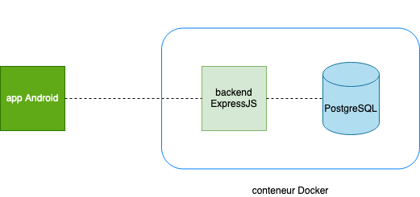

# Easy Share

## Sommaire
- [Introduction](#introduction)
- [Pre-requis](#pre-requis)
- [Lancement](#lancement)
- [Capture d'écran](#capture-d-ecran
- [Architecture](#architecture)
- [Choix de conception](#choix-de-conception)
- [Fonctionnalites](#fonctionnalites)

## Introduction
- **Classe** : ESGI 4AL2
- **Groupe 11** :
  - LAHMADI Zakarya
  - ZERGUINE Mohammed Mazene
  - ZHU Loïc

## Pre-requis
- **Docker** : https://docs.docker.com/get-docker/
- **Docker-compose** : https://docs.docker.com/compose/install/
- En tant que développeur du projet :
  - **NodeJS** : https://nodejs.org/en/download/
  - **NPM** : https://www.npmjs.com/get-npm

## Lancement
- **Docker** : `docker-compose up`

## Architecture

## Choix de conception
- MVVM (Modèle-Vue-VueModèle) :
  - **Modèle** : représente les données et la logique métier
  - **Vue** : représente l’interface utilisateur
  - **VueModèle** : représente la logique de présentation et de liaison entre la vue et le modèle

## Capture d'ecran

## Fonctionnalites
- fonctionnalitées de bases envisagées :
  - publication d’objets :
    - [x] création
    - [x] lister
    - [ ] modification
    - [ ] suppression
- fonctionnalitées bonus :
  - [x] inscription
  - [x] connexion
  - [x] déconnexion
  - [x] favoris :
    - [x] ajouter & supprimer une publication en favori
    - [x] lister les favoris
  - [ ] Publication :
    - [ ] contacter l’auteur d’une publication par mail
    - [ ] “dis/like”
    - [ ] commentaires :
      - [x] création
      - [x] lister
      - [ ] modification
      - [ ] suppression
